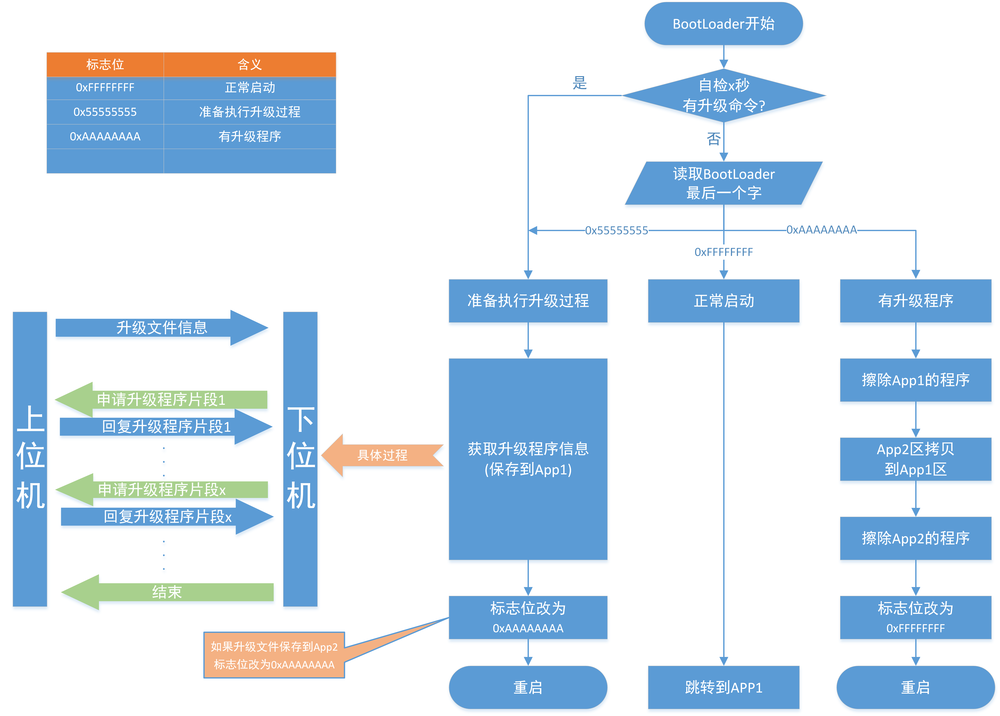
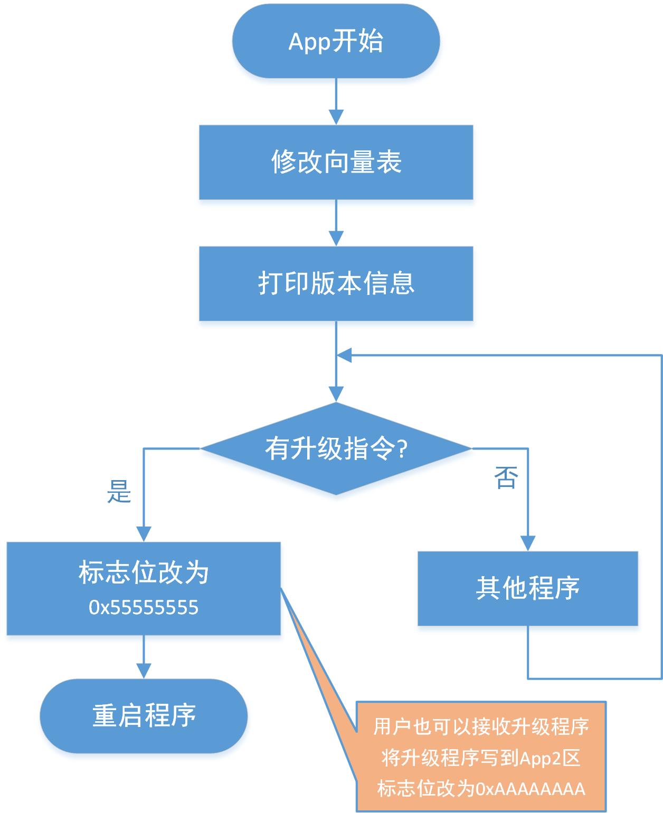
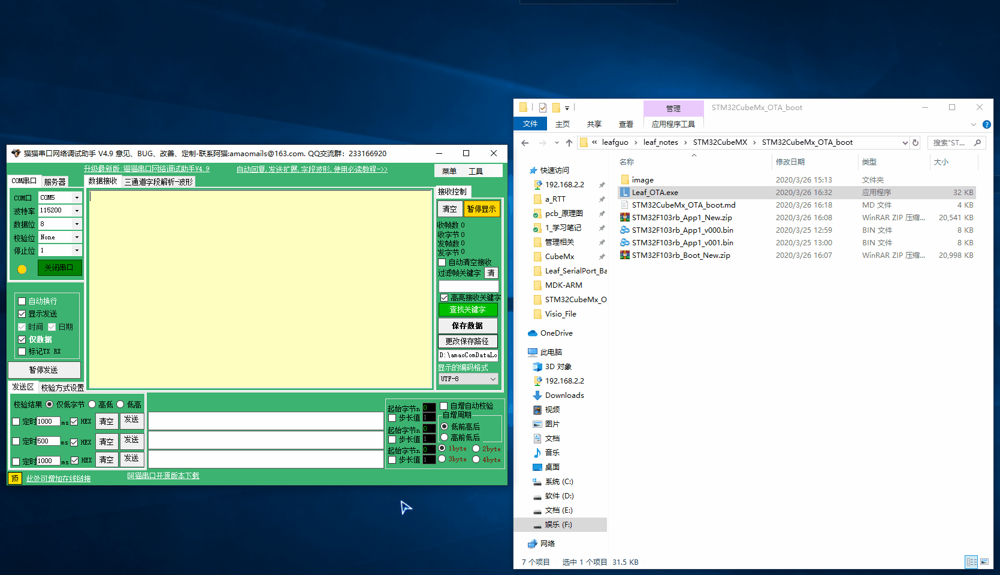

# （转载）后面有原作者地址

# STM32CubeMx开发之路—在线升级OTA—(进阶)

---

---

## 运行环境

* `Windows10`
* `STM32CubeMX` `Version 5.4.0`
* `Keil5(MDK5)` `Version 5.28.0.0`
* `硬件开发板` `F103RB-NUCLEO`

---

## 简介

* 之前的教程很多人反馈说, 比较麻烦, Ymodem协议不懂, Xshell也没用过.
* 根据反馈于是重新设计了一种全新的更简单升级思路, 并且自己写了上位机.
* 本教程采用Bootloader接收升级程序, 甚至可以不需要App2区.
* (文末会提供代码和简单的协议,但不讲解代码)

---

## 思路

* 通过Bootloader获取程序,这样每个App都可以少写很多关于OTA的代码, 减少了出错的概率.
* 同时因为Bootloader出厂之后通常是不会更改的, 因此就算升级失败, 也有补救的方法.
* 同时这样可以不进行程序的搬运, 直接就能够将代码下载进App1,甚至可以不需要App2区.
* 当然也可以保留App2区, App1也可以实现下载程序到App2的功能.

---

## 先看Bootloader的框架

* 标志位放在Bootloader的最后一页的最后一个字节.

---

## 在看App1的框架

* 收到程序之后只需要修改标志位再重启就行了(如果Bootloader有自检过程,甚至不需要修改标志为).

---

## 演示

---

## 源代码获取

> 协议是自己定的, 上位机也是自己写的.
>
** 源码已放到码云 ! ! ! ( 请点击文首链接进入仓库 ) **

---
